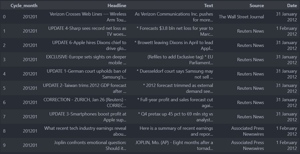

### Main Contributer for this blog: Ricky Choi (Data Cleaning), Zixian Fan (Data Analysis)

## Data Cleaning

## Data Analysis
After obtaining the cleaned news data, we started to perform some necessary analyses on the data in order to better go about applying subsequent machine learning models. We divided it into two parts: rudimentary analysis and text analysis.
 
### Rudimentary analysis

Firstly, we have the general understanding of the dataset with:

Total line of text: 12568.

Monthly period number: 132.

And, we can have a quick look of our dataframe:

From the figure, we can see that the data frame mainly consists of these five columns, where Cycle Month indicates which month of the year the article belongs to, because the model we are going to apply subsequently is learning for monthly data, which is equivalent to adjusting the frequency of the data. Headline is the headline of these news, and Text represents the news contents.

After that, we went to analyze how much news we were able to retain each month, as shown below:

Since we are capped at 100 news articles per acquisition, that number of news articles will be available in the beginning years. However, the number of relevant news obtained has declined in recent times, probably because the market's attention was not primarily on mobile phones during this period. However, since the number of news articles is roughly higher than 50, it does not unduly affect our final results.

In the meantime, we briefly analyzed the source of the text data and found that it mainly came from Reuters News and Wall Street Journal. Perhaps in the future, those who follow mobile news could check these two data sources more often.

### Text Analysis

Afterwards we would like to perform some simple analyses of the obtained text in order to better understand the data. We are going to do the analysis based on the following two pieces of code:

These codes get the five most frequent words for each month. Inevitably, however, the main words are a lot of useless connectives and articles

So we introduce nltk's stopwords to sift out these useless words. Stopwords are words similar to: {'a','about','above','after','again','against','ain','all','am','an','and','any','are','aren',"aren't",'as','at','be','because','been','before','being','below','between','both'} 

We further merge the data as well as make statistics to get the following dataframe. For example, in January 2012, the most important words in the headline were update, apple, loss, profit and sales, etc.

Finally, we construct Word Cloud and Word Co-occurrence Network Graphs to make some more intuitive interpretations. Word Cloud shows which words appear most frequently in all text, and the higher the frequency the larger the word. We can see that words like Microsoft, profit, said, Lenovo are the most important words in mobile phone related news.

The Word Co-occurrence Network Graphs shows the co-occurrence relationships between words in text data. In this graph, each node represents a word, and the edges indicate how often these words occur in the same text. The positions of the nodes are determined based on a network analysis algorithm, and their positions usually reflect the relationships between the nodes. Nodes that are closer together indicate that they co-occur more frequently in the text. And the size of the nodes can be adjusted according to the frequency of occurrence of the words, and words that occur more frequently are usually shown as larger nodes. The number of edges indicates the number of occurrences between two words, and the thickness of edges is usually proportional to the frequency of occurrences.
From there, we can see in the chart below that words like company, apple, china, and samsung are the most frequent words that appear alongside other words. The occurrence of pandemic, trump, and russia at the edges also gives us a sideways view of the significant times in which these words appear.

## Final Remark
From the Data Cleaning and Data Analysis sections above, we gained a better understanding of our textual data, which prepared us for the subsequent work of understanding text and thinking about how to transform it to ask quantifiable variables.